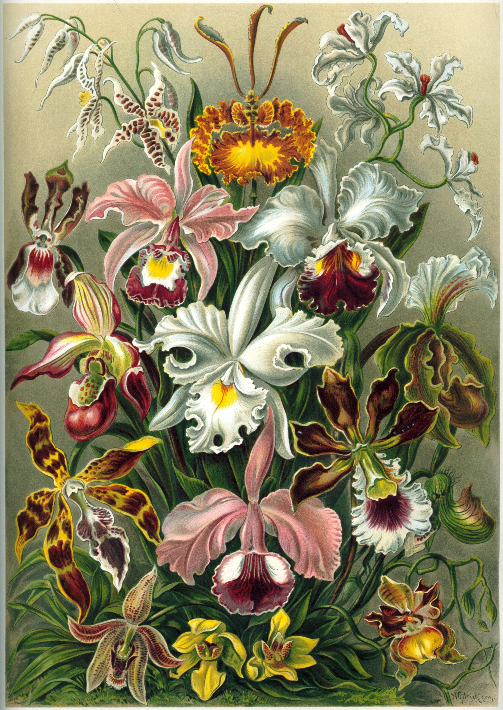

+++
title = "About"
menu = "main"
weight = 1
+++

# About

Contained here are thoughts, musings, and various other attempts to reason through the world. The
rationale behind starting this blog, the way I conceive of the writing in it, etc. are contained
in \[insert post\].

___

In creating a visual language for this website I employ the illustrations of famed naturalist [Ernest Haeckel](https://en.wikipedia.org/wiki/Ernst_Haeckel). The Favicon is Haeckels
[illustration](https://en.wikipedia.org/wiki/File:Haeckel_Spumellaria.jpg) of [Spumellaria](https://en.wikipedia.org/wiki/Spumellaria). Below you can see his illustration of various members of the [Orchid family](https://en.wikipedia.org/wiki/Orchid). Haeckel's work hinged on careful observation. This observation led him to find beauty and order. It also led him to since disproven ideas that were at times racist (and weaponized as such). I find Haeckel's journey instructive. It is through intentionally watching/listening/feeling the world that we arrive at interpretations about its structure. Yet, we should never let our conclusions blind us. The unexpected and under-considered is where truth and magic live.

*[Orchidae](https://en.m.wikipedia.org/wiki/File:Haeckel_Orchidae.jpg) by Ernst Haeckel*

