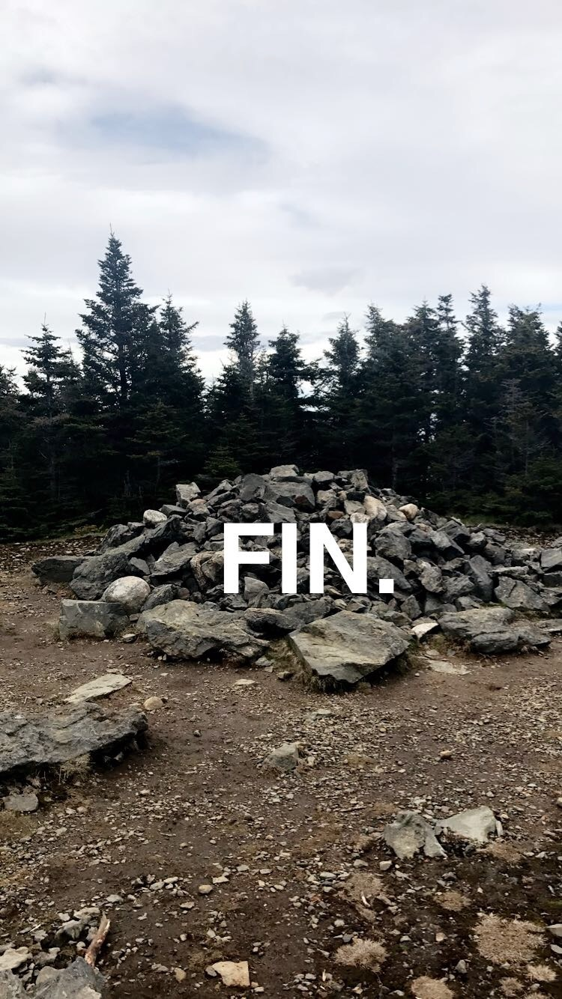

# Discussion: On Starting a Web Log in Two Thousand and Twenty Five Anno Domini
*May 25, 2025*

So I have decided to start a blog.  It feels like I'm doing it because of an embarrassingly nostalgic impulse - I yearn for the internet of the aughts like a moth yearns for the moon! It also feels like one of the more important things I can do at this very moment. I'm going to attempt to reason through the "why" of it, and go on to how I conceive of this blog. 

30 is approaching me like a comet. At the time of writing it's less than a month away. It's an arbitrary ticker mark, sure, but it's a big arbitrary ticker mark. Critically: I can say with relative confidence that the structure of my life is largely settling into place. I'm imagining a sort of jello mold I'm hardening into[^1]. Inertia will win, if I let it. This realization compels me towards a greater degree of intentionality in my life: I have to try harder to do what I wish, I have to more actively choose what I think, how I spend my time. I feel confident that I can live in this world - it's now incumbent on me to make sure that life is rich to the degree that I want it to be. To write feels like an active act towards that enrichment. It's how I think, so by writing I choose to think. And it's work. 

Speaking of work: it's never been easier to choose NOT to do the work of thinking. I am writing this while swimming in the AI discourse and it's become pretty clear that the advent of Generative LLMs is decapitating [learning from education](https://nymag.com/intelligencer/article/openai-chatgpt-ai-cheating-education-college-students-school.html), removing [inherent joy](https://www.nytimes.com/2025/05/25/business/amazon-ai-coders.html) from my profession, and all around erasing society's ability to [discern truth](https://www.economist.com/science-and-technology/2024/01/17/many-ai-researchers-think-fakes-will-become-undetectable). Scary stuff! I also think AI is [Normal Technology](http://knightcolumbia.org/content/ai-as-normal-technology), and that it can be easily controlled with smart, active regulation + time to build societal antibodies[^2]. On the whole I think we'll be okay. However, these changes still impose individual choices. One could, with remarkable efficiency, offload the work of discerning truth and meaning onto a privately controlled for-profit computer program. I don't feel particularly able to enunciate a cure for that problem BUT, I can do my best to try and solve for it in my own life by really FORCING myself to think. 

So, I plan on writing. To start, I'm not going to set any specific goals for this little blog. I'd like to see where things go. However, I'd like to largely do 4 main types of writing, where each piece of writing is prefixed with its type. Those are: 

**Anecdotes**: I hold myself to pretty low standard here. These are chances to talk through subjective experiences and memories. I hope these anecdotes may prove emotionally potent and somewhat elucidating. At worst I hope they'll at least be amusing.  

**Discussions**: this is me trying to work through an idea. I predict this will be the most common type of writing. It's hard for me to build steel-clad conviction in my own opinions and thoughts, so I hope these discussions can be a place to reason through ideas and build up conviction. 

**Essays**: this will be writing for which I feel I have sufficient conviction and expertise. Real, meaty arguments I am compelled to make. With teeth. My hope is that sufficiently thought-out discussions can evolve into these. 

**Miscellanea**: Random lists, recommendations, or other odds and ends. These should be low-effort, and ideally: fun! We love fun, don't we folks?

The last key question to work through is: "what about the audience - who is this for?" I see two ways of approaching this: thinking of the audience as a **subject**, as well as a **participant**. The audience is a "subject" to which I am directing my writing. I will try, as best as I can, to not think this way. A direct consequence of my rationale above is that I am doing this for *me*. The bulk of the writing I do is intended as a way of making sense of whatever is going on in my own head. If any of the essays end up with sufficient "umph" I may choose to submit/publish them somewhere. TBD. I also don't intend to profit off of this effort (but if you're so inclined my Venmo is `@Yotam-Bentov` 😘). 

The other purpose of an "audience" is as a **participant** to discuss the writing I'm doing. This, on the other hand, I do find quite compelling. The internet is excellent at [attracting experts to mistakes](https://meta.wikimedia.org/wiki/Cunningham%27s_Law), and I earnestly would really enjoy working through ideas *with* people. To that effect, I will try to include some basic commenting functionality. For now there is the Github repo where this blog is hosted. I might try and include other commenting mechanism down the road (comment providers? Hacker News links? something else? Not sure! [Contact](/contact) me if you have opinions about this). That said, the internet tends towards ignorant sensationalism, and moderating these comments (should they arrive) sounds sisyphean. That said, in all likelihood I can just expect silence. 

Still, I will write. Let's see where this goes!

 
*In 2017 I finished ascending all of [New Hampshire's 48 4k footers](https://en.wikipedia.org/wiki/Four-thousand_footers). This is a picture of the rock mound on top of [Mount Hale](https://www.alltrails.com/trail/us/new-hampshire/mount-hale-via-hale-brook-trail), which was the final peak for me. Pretty friggin' underwhelming wouldn't you say? This picture serves as a self-directed reminder that it really is about the journey, and not the destination.*

[^1]: In this analogy I am indeed the jello -  I'm thinking [dessert lime](https://trustables.com/collections/jell-o?srsltid=AfmBOor9yXwdy6vyh0wXeW_ntoJ20DOpkELRBZP7NlE1T9l7n6jnRvCb) flavored?
[^2]: Might take a while though? We're still inoculating ourselves against technology created [two decades ago](https://en.wikipedia.org/wiki/Facebook#History).
