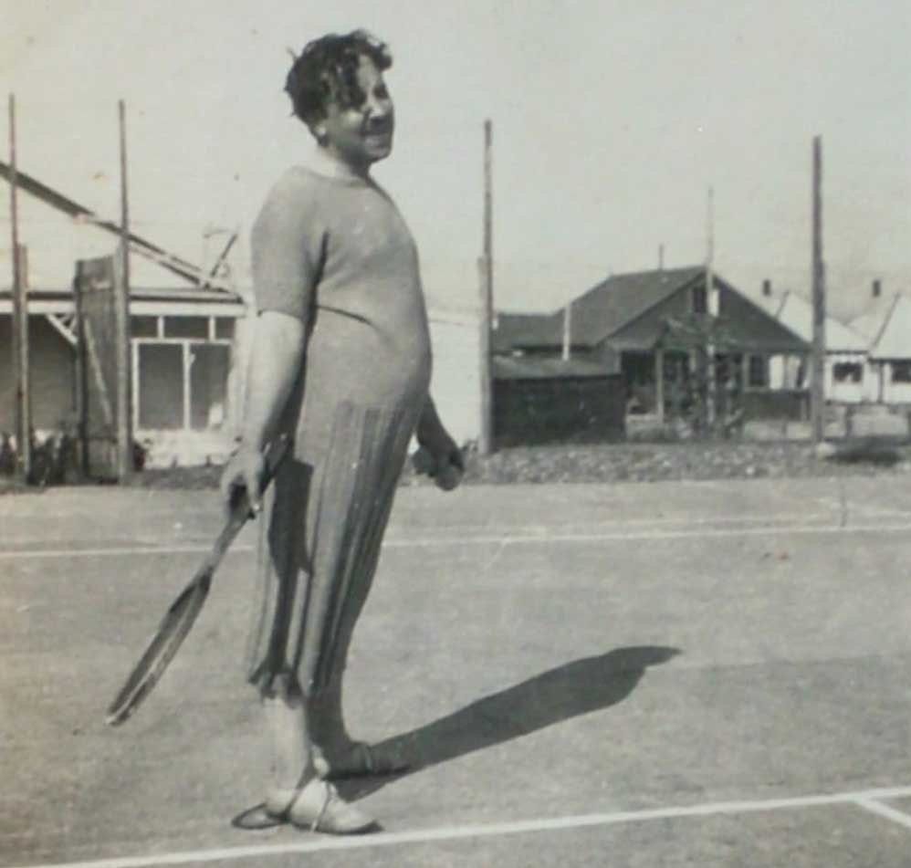

---
tags:
  - Writing
  - Sports
slug: 2025-09-05-on-three-players
date: 2025-09-05
title: A Reflection on Three Players
description: A quick thought on sports and hope
---
# A Reflection on Three Players

...at the eve of the US Open final. 

The first: a generational talent. Technique, athleticism, the works. Champions. Their achievement serve as the peak to which we aspire. They are the protagonist of the spectacle. While their face features on billboards we do not see into their heart. So what if it's [empty](https://www.theguardian.com/sport/2009/oct/29/andre-agassi-hate-tennis)
? This thing at which they excel is a chain around their neck. Or maybe - this is just a weakness of their game. They just need to sort their head and [go on](https://www.npr.org/2025/09/04/nx-s1-5528663/naomi-osaka-amanda-anisimova-us-open-semifinals).  

The second is the expert. The commentator who [never played](https://www.npr.org/sections/thetwo-way/2017/12/22/572782496/sportscaster-dick-enberg-whose-career-spanned-60-years-dies-at-82). The enthusiast who can hear the music thumping through the halls, but has to stay outside. Their knowledge and devotion is palpable, but how can you trust someone who has never really been inside?  

Finally: the failed romantics. Those that can glimpse glory, but have it be just barely [out of reach](https://www.atptour.com/en/rankings/singles?rankRange=201-300). They are stuck in the no-man's zone of aspiration. Their heart is devoted, but their body won't give. The stars have to align just right, they just didn't for them. But they try...

My question: who do we admire the most? Financially it's in the order as presented. The stars, followed by the experts, and then finally there's a crushed trail of those unceremoniously moving on. This is all a cliché. I just try to keep in mind the long trail of athletes who tried to make it but didn't. We risk very little to cheer for those guys, but we should. It's that failed devotion that sanctifies everything else around it. It's their hope that makes tomorrow holy.  

Now, by tomorrow it's too late. The ATP sub-200 have already packed their bags and left. I guess this is just a reminder to myself to watch some prelims next time. There's some pretty great tennis in there too. 

*See, now Hitchcock had heart! Photo courtasy of the wikimedia commons. [Source](https://commons.wikimedia.org/wiki/File:Alfred_Hitchcock_playing_tennis_1920s.jpg)*