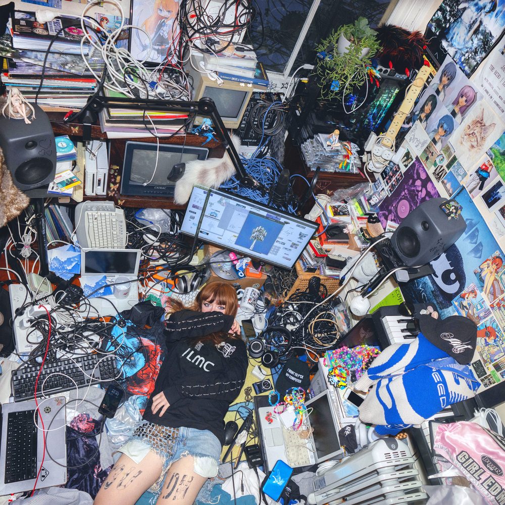
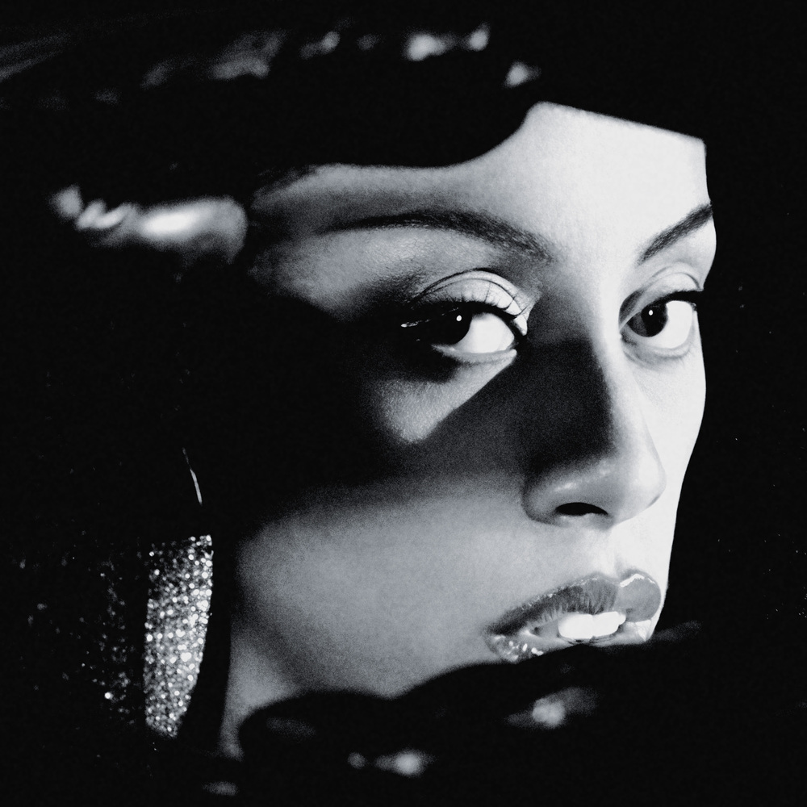
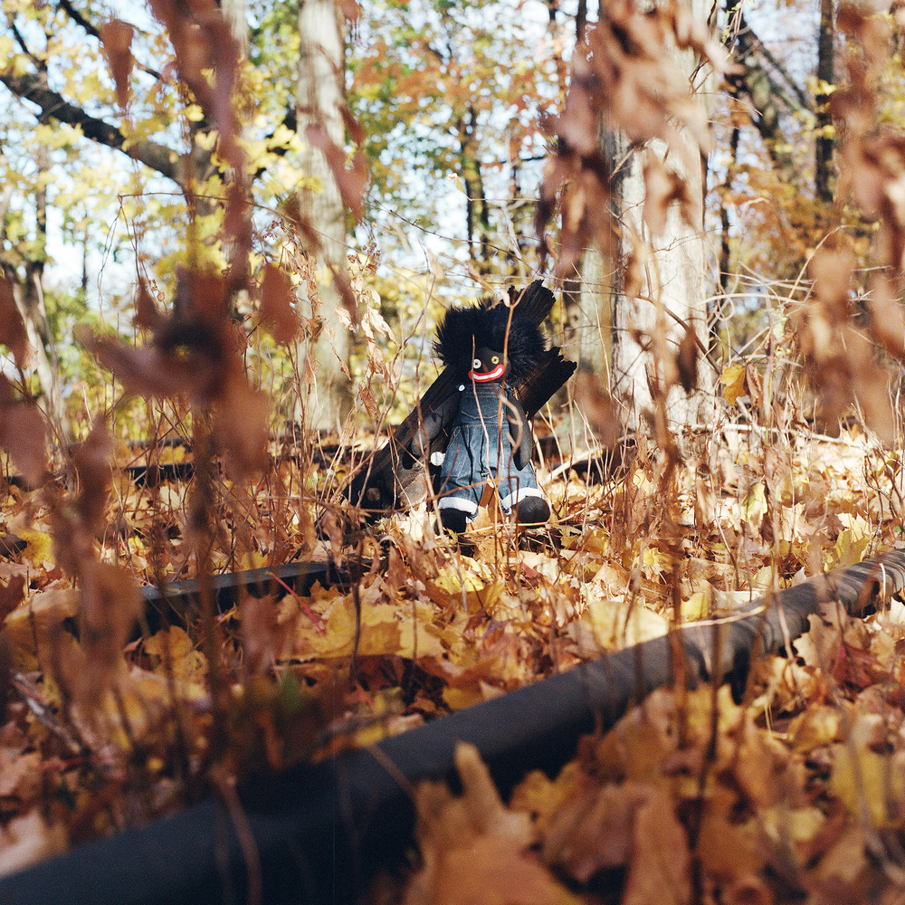
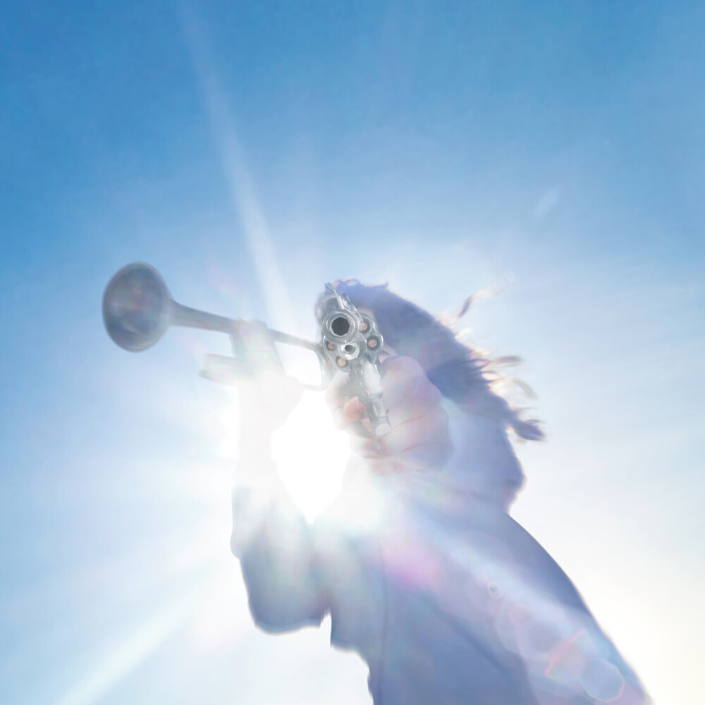
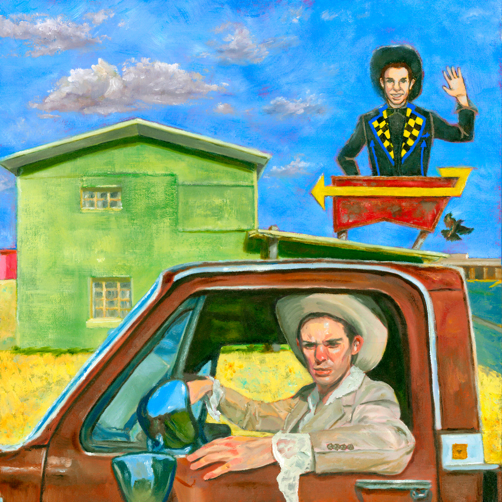
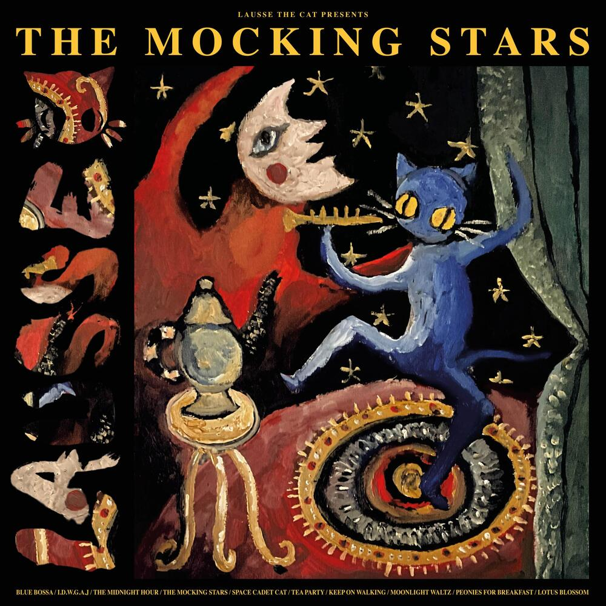

# **Miscellanea**: 8 Albums I Really Enjoyed in 2025

*January 1, 2025*

These are the albums that soundtracked an otherwise miserable year. Many formerly-bashful demons are now emerging out of the shadows but this time with their chest out. We're all scared! But music was very good, and served as a momentary salve from this fkn year.

This list includes no scores nor ranking. Internet preference cataloging makes for fun self-referential discourse, but I want no part of it here. I have no intention to offer a critic's review, nor a tastemaker's recommendation. Let Fantano have his strong-7s - I'm just here, listing the albums that provided me with brief moments of escape or reflection during 2025.

Note: I've included cover art, downloaded from [covers.musichoarders.xyz](https://covers.musichoarders.xyz/), a real gem of a site. Copyright is the artist's/label's. 

## Ninajirachi - I Love My Computer

I think Ninajirachi's debut album might be the best art I've come across that was made *about* the internet. Specifically, about the experience of growing up alongside the internet, and the moments of lust, horror, and wonder that are transmitted through your computer screen. I, too, spent my childhood with the internet - in curiosity rabbit holes, in multi-hour game trances, in idiosyncratic message boards, and in shaky pubescent chat room conversations. My first real romantic interactions occurred in ICQ (AOL-equivalent). I was there in the 4chan primordial soup. I saw things that have shaped me and have repulsed me. And they all felt like a kind of home, if even refuge.

Ninajirachi gets this, and makes music about those exact computer-mediated (induced? partnered?) feelings. *Delete* describes the experience of posting pictures of yourself as a hand reaching out through the wired fog, hoping to induce reciprocation in the object of your own maddened desire. *Infohazard* describes the all-too-familiar experience of accidentally stumbling across some horrific content as it permanently imprints its after-image on your unprepared consciousness. *iPod Touch* is about the quotidian joy of hearing a song you love on a bus ride home. *Fuck my Computer* is about, um, fucking your computer.

It's a nostalgic record that draws heavily from the big-house EDM sounds of the early 2010's. The source material she's referencing was (and is) inescapably cloying. EDM is algorithmically structured around the maximization of "big moments." Yet, Ninajirachi takes the genre and imbues it with both joy and meaning.

## Rochelle Jordan - Through the Wall

This is just a very excellent House album. Rochelle has a maestro's grasp of the genre, in its varied sounds and textures. She sings in sweet reverbed vocals about desire and heartbreak. Nothing earth-shatteringly different, just deeply refined, competently controlled, and eminently danceable. It's music for dark rooms filled with craving. Cool. Sexy. Really great.
## Billy Woods - Golliwog

There is an idea from early Buddhist teaching that one should meditate on the "ugliness of the body"[^1]. The gist: by considering the ugliness of both one's own body, as well as the body of others, one can separate themselves from the desire associated with the body itself.

Golliwog, in turn, is a meditation on the sordid state of the world, and the personal suffering it induces. Over a dark near-hour Billy Woods raps about the horrific and the hideous: murder, state violence, torture, colonialism, predation, homelessness, injury, blood, pollution - to name a few. There is no attempt at hope or recourse; this is an exercise in enumerating plagues. Ideas exist in a cerebral haze as Woods's flows thread concepts over dense and muddy jazz beats.

I adore this album for its ability to just be so goddamn dark. Sometimes it's important to just linger, to meditate, on the ubiquitous grossness of it all. It's a hard listen, but one that is spiritually important.
## Rosalía - LUX

To qualify/detract: the claims of "13 languages!" feel overwrought, and the hyper-drama of the whole enterprise can feel too self-serious. The second half of the album isn't *quite* as strong or cohesive as the first. The big-name features don't add much, and the lesser-name features are relegated to the weaker tracks.

And yet,

Rosalia has the magnitude of heaven in her voice, and the art-obsession of a baroque composer. I felt literal chills on the vibrato notes on *Mio Cristo Piange Diamanti* and felt the weight of hope on the album's closer *Magnolias*.

When this album soars it is monumental.
## Silvana Estrada - Vendrán Suaves Lluvias

A beautiful record. Cozy and warm songs about heartbreak, love, and transcendence through the power of one's own spirit. A joy to listen to beginning to end - one of these records that served as the background music to many moments of private peace or savored time with friends. I just loved having it on.
## Geese - Getting Killed

I'm not adding to the discourse. Go consult your favorite music publication on this one. Rock n' roll is back and we're all sulking/dancing around the Prospect Park Bandshell[^2]. *Long Island City Here I Come* feels like the anthem of a generation demanding to burst forward. This album is the most fun I've had listening to dudes and gals playing guitars in years.
## Hayden Pedigo - I'll be Waving as You Drive Away

I'm realizing, writing all of this out, that the thing I've actively sought in music this year was proud proclamations of beauty. I don't need music that sedates or numbs the horrors of this past year. Instead, I want music that actively chooses to recognize the beauty in this world and the many ways it can manifest. Beauty in kindness. Beauty in yearning. Beauty in the sky, and the earth, and little oddities on the outskirts of town. Beauty in solitude. Beauty in company.

It's in this state that this album, and Hayden Pedigo, found me. I saw Hayden open for Ichiko Aoba at King's Theater. He seemed shy, almost bashful. He professed that he hasn't been playing much on stage recently, due to debilitating stage fright. He restarted two separate songs.

But this didn't come off as amateurish. Rather, it felt like Hayden's confessions weren't excuses - rather, through open sharing of his own, he encouraged us to open ourselves a little bit more to the performance. His music has no lyrics, and often no accompaniment. He wants us to listen, and to ponder the flat plateau that surrounds his hometown of Amarillo, TX. In turn, Hayden has cultivated a dedicated audience that approaches him with the same kindness and sincerity that he radiates.

There is the cultural wave of "new sincerity" - the idea is the best way to confront the many evils of contemporary life, and to live amongst them, is to greet them with disarming sincerity and openness. We should really mean what we say when we ask our friends "how are you?" Then, we should really listen. We should be embarrassingly happy, or sad, or whatever we really feel. Hayden's music doesn't, of course, preach any of this directly. Instead there is an almost sorrowful feeling that imbues every song, but it's the sorrow of being really, presently **here**.

## Lausse the Cat - The Mocking Stars

Music has always been a refuge for the slacker. The devil lies in idle hands, but music has always been the stage where the slacker can best present their arguments - the world is scary, daunting, complex, hurtful. In response? Let's hang out. No agenda - just calmly observing it all go by. Not inaction, but indolence.

Lausse embodies the slacker character with mastery and beauty.  He mixes English with French, and calmly raps over lush instrumental beats that weave neo-soul and bossa-nova. The album's second track *I.D.W.G.A.J* - an initialism for "I don't want to get a job"(!) seems like the only apt response to an increasingly ravenous hustle-culture background noise. The sprawling eponymous track "The Mocking Stars" describes a mythical story of a cat, frustrated with the world around him, tearing the sun from the sky. In the resulting anarchy the earth burned and people suffered. The cat, watching all of this, wished to depart the earth and be united with his beloved moon. However, unable to reach her, the stars responded, mocking him:

> No chance, little cat, you ain't died yet, our moon shines for the fellas in the fire pit

Resigned, the cat boarded a raft, and continued sailing a river made of his tears. Yet, despite his sorrow the cat concluded.

> When my eyes meet starry nights
> The thought of never being again gives me a fright
> When I watch a face adored
> Then I weep to think I'll see said face no more

The archetypical slacker is not numb, rather - they feel the world a touch too much. The only viable course of action is to marvel at the beauty that is still there, ever present.

[^1]: https://suttacentral.net/iti85/en/sujato?lang=en
[^2]: https://www.youtube.com/watch?v=Xee_2r-5L2U
