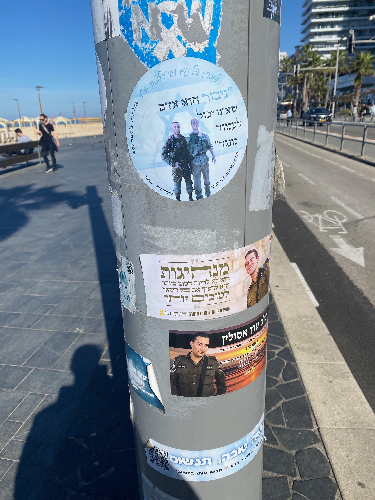
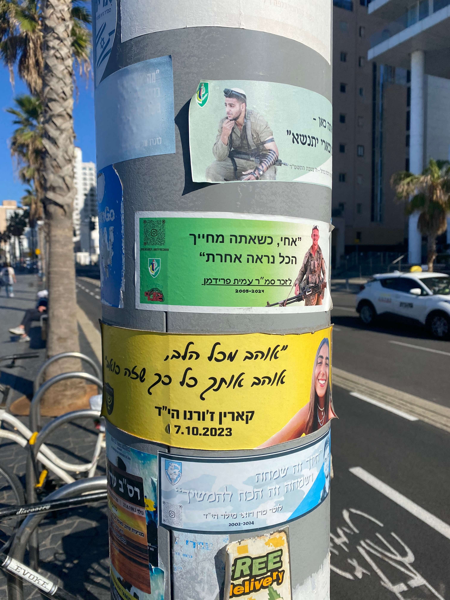
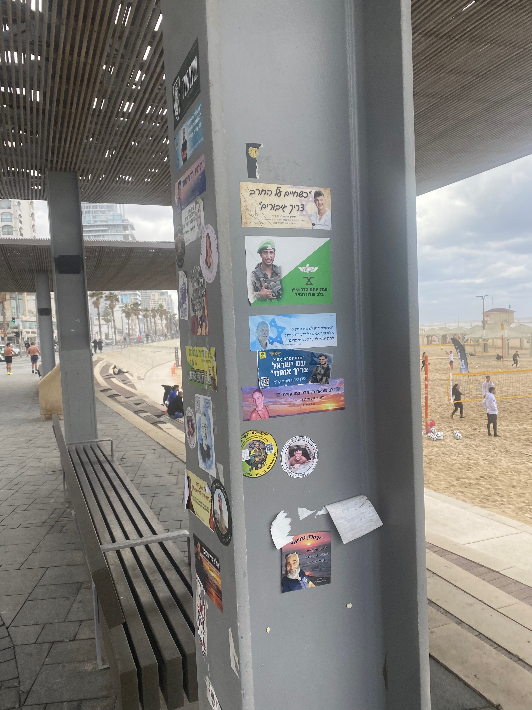

# **Anecdote**: Sticker Tombstones on the Tel Aviv Tayelet
*January 6, 2026*

I haven't visited Israel since about 2021, and definitely not since the events of October 7th. One of my cousin's has had two daughters since last time I saw him. The older one is two years old. She's incredibly sweet and precocious. The country itself is in a bad state. The trauma and grief are palpable and ever present. 

The thing that I didn't know about, and was really struck by, were these stickers of the deceased that have now been put up in many public spaces. I'm told this is a totally decentralized effort - folks are commemorating their friends who died on October 7th or in the military action that's taken place since. 

Mentions of Gazan suffering are almost entirely non-existent save for some large-format graffiti I saw on the way to Jerusalem. It read: "there are people in Gaza / they are also alive." Since I've arrived it's rained a couple nights. Many Gazan families have been evacuated to disaster-relief tents on Gaza's beach[^1]. An infant's body-to-surface-area ratio makes it so they lose heat much faster than adults. The relief-tents are not heated. Babies die[^2]. 

I want to write more about this, but for now here are some of the stickers. I'll save interpretation for a different post. I'm still mulling all of this darkness. 

Translating from top to bottom starting with the sticker of the two soldiers: "a hero is someone who can stand against", "leadership is not to be the best, but to make others better", can't read the one below, but the one with the QR code is some guy's youtube channel. 

Translating from top to bottom starting with the green to white gradient with the instagram qr code at the top left: "bro, when you're smiling everything looks better", "I love you from my whole heart, love you so much it hurts", "a smile is happiness and happiness is the power to keep moving." At the bottom there's an ad for a marijuana delivery service. 

Top to bottom, starting with the beige-colored sticker with the white shirted man: "when we live by the sword, we need heros", "Sgt. Yotam Halal YH"D[^3] always in our hearts", "the question isn't what we deserve, but every moment how I can give more to the people and to the state", "'whatchya mean bro? The people of Israel need you' / cpt. Liran Shanir Y"HD", "a heart that saw every human in the world / in memory of Shiran Ganon YH"D" I can't really read the two round stickers. At the very bottom, just the top text: "'and you chose life'".

[^1]: https://www.theguardian.com/world/2026/jan/03/tents-supplied-to-displaced-palestinians-inadequate-for-gaza-winter

[^2]: https://www.aljazeera.com/features/2025/12/18/baby-mohammed-freezes-to-death-as-gaza-battles-winter-and-displacement

[^3]: There are standard suffixes added to the names of the deceased in Judaism. If they died a "usual" death you add Z"L (Zichrono Lebracha), literally: "may their memory be a blessing". If someone was murdered for being Jewish their name is suffixed with HY"D (HaShem yikom damo), literally: "may Hashem avenge their blood."
